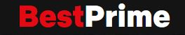

          <nav>
          <a href="#Technologies">Tecnologias </a>|
          <a href="#library">Bibliotecas </a>|
          <a href="#Project">Projeto </a>|
          <a href="#knowledge">Conhecimentos</a>
          </nav>

 

 

<h1 align="center"> Clone de Interface do Netflix </h1>
          
 
 

 
 

<h2 id="Technologies"> Tecnologias </h2>

Esse projeto foi desenvolvido com as seguintes tecnologias:

- HTML
- CSS
- JavaScript
   

<h2 id="library"> Bibliotecas </h2>

- <a href="https://owlcarousel2.github.io/OwlCarousel2/">JQuery Owl Carousel</a>
   

<h2 id="Project"> Projeto </h2>

Esse projeto foi baseado na interface do principal site de streaming mundial(Netflix) utilizando tecnologias simples como HTML5, CSS3 e JavaScript.

Foi desenvolvido em curso da <a href="https://web.digitalinnovation.one">Digital Innovation One</a>.
   
 

<h2 id="knowledge"> Conhecimentos </h2>

Nesse projeto foi desenvolvido conhecimentos relativos a como estruturar um layout, técnicas de CSS3 com containers, variáveis e responsividade, como posicionar os elementos com Flexbox e como utilizar plugins Jquery.
